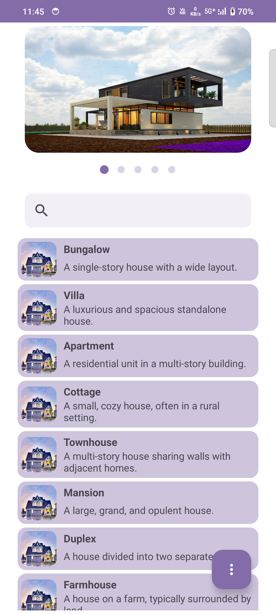

# Carousel App

Welcome to the Carousel App! This application provides a comprehensive overview of various categories, including sports, plant, food, shoe, and country.

## Features

1. **Top Carousel**
  - Displays the current carousel type (e.g., SPORTS, PLANT, FOOD, SHOE, COUNTRY).
  - Sliding the carousel updates the list items and carousel type.

2. **Search Functionality**
  - Allows users to search within the carousel list.
  - The search box floats and remains accessible when the user scrolls upward, and the top carousel collapses.

3. **Carousel Analysis**
  - Users can view the current analysis of a carousel.
  - Analysis includes:
    - Carousel list count.
    - Maximum three-character occurrence value in title of Carousel list.

## Libraries Used

This application uses several libraries to provide a robust and efficient development experience. Below is a list of the libraries used in the Carousel App:

- **AndroidX Libraries:**
    - `androidx.core:core-ktx` - Provides Kotlin extensions for core Android components.
    - `androidx.appcompat:appcompat` - Adds support for modern Android features on older devices.
    - `androidx.activity:activity-ktx` - Provides Kotlin extensions for activity-related functions.
    - `androidx.constraintlayout:constraintlayout` - Used for flexible and efficient layouts by following a flat hierarchy.
    - `androidx.lifecycle:lifecycle-runtime-ktx` - Provides Kotlin extensions for lifecycle-aware components.
    - `androidx.fragment:fragment-ktx` - Offers Kotlin extensions for Fragment operations.

- **Material Design:**
    - `com.google.android.material:material` - Implements Material Design components and themes.

- **Dependency Injection:**
    - `dagger.hilt.android:hilt-android` - Simplifies dependency injection in Android applications.
    - `dagger.hilt.compiler:hilt-android-compiler` - Annotation processor for Hilt.
    - `androidx.hilt:hilt-compiler` - Hilt compiler for AndroidX integration.

These libraries enhance the functionality and maintainability of the Carousel App, making development more efficient and the app more reliable.

## Screenshots

---

Thank you for using the Carousel App !!!
